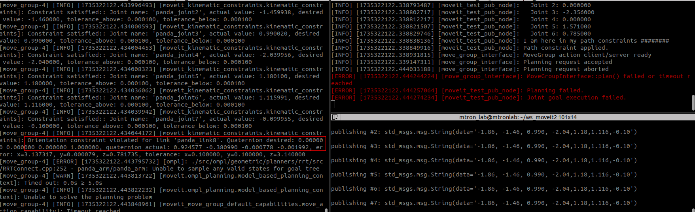

# Clutterbot-MoveIt2-Assignment

## Instructions:

Location: Inside Moveit2 tutorial repository. 
`cd ~/ws_moveit/src/my_moveit`

## Build:
Complete build:  
`cd ~/ws_moveit/`  
`colcon build --mixin release`  
Selective build:  
`
colcon build --packages-select my_moveit
`

## Description of scripts:
1. **test_node101.cpp**:  
* Sends Pose goal and Joint goal using custom planners and with path constraints.
* Contains Subscriber for Pose goal and Joint Goal along with PoseToPlan and Joint Function with Custom Planner Loader and Path cnstraints.
* Arguments: use_custom_planner,use_path_constraint.

3. **obs_planner.cpp**:  
* Plans for pose with and without obstacle and executes the shorter trajectory.
* Contains Obstacle addition and removing functions and Trajectory Processing function.

## Commands:

### Part 1: Initialisation and setup of Pose goal and Joint goal topics.

To launch Move_group: 
`ros2 launch ws_moveit2 demo.launch.py` (using the tutorial's launch file). 

To Start node with default planner and without constraints: 
`ros2 run my_moveit test_node101`

To Publish to _Pose Goal_: 
`ros2 topic pub --once /pose_goal geometry_msgs/msg/Pose "{position: {x: 0.5, y: 0.0, z: 0.590}}"`

To Publish to _Joint Goal_: 
`ros2 topic pub --once /joint_goal std_msgs/msg/String "data: '-1.86, -1.46, 0.990, -2.04,1.18,1.116,-0.10'"`

### Part 2: Functions for Pose goal and Joint goal.

To launch Move_group: 
`ros2 launch ws_moveit2 demo.launch.py`

### Part 2.1: To Start node with custom planner and without constraints:
`ros2 run my_moveit test_node101 --ros-args -p use_custom_planner:=true`

<figure>
  
  <figcaption>Parameter set to specific Planner</figcaption>
</figure>

 
 

To Publish to Pose Goal: 
`ros2 topic pub --once /pose_goal geometry_msgs/msg/Pose "{position: {x: 0.5, y: 0.0, z: 0.590}}"`

 

### Part 2.2: To Start node without custom planner and with constraints:
`ros2 run my_moveit test_node101 --ros-args -p use_path_constraint:=true`

<figure>
  
  <figcaption>Using Constraint</figcaption>
</figure>

 
 

To Publish to Joint Goal: 
`ros2 topic pub --once /joint_goal std_msgs/msg/String "data: '-1.86, -1.46, 0.990, -2.04,1.18,1.116,-0.10'"`

<figure>
  
  <figcaption>Failed to Plan</figcaption>
</figure>

 

### Part 3: Planning with and without obstacle & Trajectory Post processing:

To launch Move_group: 
`ros2 launch ws_moveit2 demo.launch.py`

To _add obstacle_, plan, with and without obstacle and _post processing_: 
`ros2 run my_moveit obs_planner`

**GIFs:**
1. _Adding and Removing Obstacles_

<figure>
  
  <figcaption>Failed to Plan</figcaption>
</figure>

 

3. _Trajectory Post-Processing_   

  <figure style="display: inline-block; text-align: center; margin-right: 14px;">
    
    <figcaption>Trajectory 1</figcaption>
  </figure>
  <figure style="display: inline-block; text-align: center;">
    
    <figcaption>Trajectory 2</figcaption>
  </figure>

## References:
1.[Moveit2 Tutorials](https://moveit.picknik.ai/main/doc/examples/motion_planning_api/motion_planning_api_tutorial.html)  
2.[Path Constraint tutorials](https://moveit.picknik.ai/main/doc/how_to_guides/using_ompl_constrained_planning/ompl_constrained_planning.html#orientation-constraints)  
3.[Automatic Addision](https://github.com/automaticaddison/mycobot_ros2/blob/main/mycobot_moveit_demos/src/plan_around_objects.cpp)  
4.[Rucking_traj_smoothing](https://moveit.picknik.ai/humble/api/html/ruckig__traj__smoothing_8cpp_source.html)  
5.[Misc Issues](https://answers.ros.org/question/281929/collision-checking-using-moveit/)  

